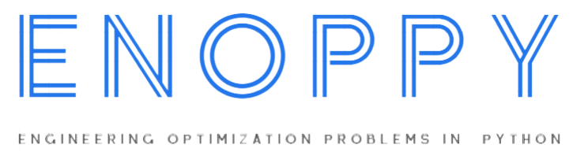

<p align="center"></p>

---


[](https://github.com/thieu1995/enoppy/releases)
[](https://pypi.python.org/pypi/enoppy) 
[](https://badge.fury.io/py/enoppy)


[](https://pepy.tech/project/enoppy)
[](https://github.com/thieu1995/enoppy/actions/workflows/publish-package.yaml)

[](https://enoppy.readthedocs.io/en/latest/?badge=latest)
[](https://t.me/+fRVCJGuGJg1mNDg1)
[](http://isitmaintained.com/project/thieu1995/enoppy "Average time to resolve an issue")
[](http://isitmaintained.com/project/thieu1995/enoppy "Percentage of issues still open")

[](https://git-scm.com/book/en/v2/GitHub-Contributing-to-a-Project)
[](https://doi.org/10.5281/zenodo.7953206)
[](https://www.gnu.org/licenses/gpl-3.0)


ENOPPY (ENgineering Optimization Problems in PYthon) is the largest python library for real-world engineering 
optimization problems. Contains all real-world engineering problems from CEC competitions and research papers.

* **Free software:** GNU General Public License (GPL) V3 license
* **Total problems**: > 50 problems
* **Documentation:** https://enoppy.readthedocs.io/en/latest/
* **Python versions:** 3.7.x, 3.8.x, 3.9.x, 3.10.x, 3.11.x
* **Dependencies:** numpy, scipy, matplotlib


# Installation

### Install with pip

Install the [current PyPI release](https://pypi.python.org/pypi/enoppy):
```sh 
$ pip install enoppy==0.1.0
```

### Install directly from source code
```sh 
$ git clone https://github.com/thieu1995/enoppy.git
$ cd enoppy
$ python setup.py install
```


### Lib's structure

```code 
docs
examples
enoppy
    paper_based
        pdo_2022.py
        rwco_2020.py
    problem_based
        chemical.py
        mechanism.py
    utils
        validator.py
        visualize.py
    __init__.py
    engineer.py
README.md
setup.py
```


# Usage

After installation, you can import ENOPPY as any other Python module:

```sh
$ python
>>> import enoppy
>>> enoppy.__version__
```

Let's go through some examples.


### Examples

How to get the problem and use it

```python
from enoppy.paper_based.moeosma_2023 import SpeedReducerProblem
# SRP = SpeedReducerProblem
# SP = SpringProblem
# HTBP = HydrostaticThrustBearingProblem
# VPP = VibratingPlatformProblem
# CSP = CarSideImpactProblem
# WRMP = WaterResourceManagementProblem
# BCP = BulkCarriersProblem
# MPBPP = MultiProductBatchPlantProblem

srp_prob = SpeedReducerProblem()
print("Lower bound for this problem: ", srp_prob.lb)
print("Upper bound for this problem: ", srp_prob.ub)
x0 = srp_prob.create_solution()
print("Get the objective values of x0: ", srp_prob.get_objs(x0))
print("Get the constraint values of x0: ", srp_prob.get_cons(x0))
print("Evaluate with default penalty function: ", srp_prob.evaluate(x0))

```

Design my own penalty function:

```python
import numpy as np
from enoppy.paper_based.moeosma_2023 import HTBP
# HTBP = HydrostaticThrustBearingProblem

def penalty_func(list_objectives, list_constraints):
    list_constraints[list_constraints < 0] = 0
    return np.sum(list_objectives) + 1e5 * np.sum(list_constraints**2) 

htbp_prob = HTBP(f_penalty=penalty_func)
print("Lower bound for this problem: ", htbp_prob.lb)
print("Upper bound for this problem: ", htbp_prob.ub)
x0 = htbp_prob.create_solution()
print("Get the objective values of x0: ", htbp_prob.get_objs(x0))
print("Get the constraint values of x0: ", htbp_prob.get_cons(x0))
print("Evaluate with default penalty function: ", htbp_prob.evaluate(x0))
```

For more usage examples please look at [examples](/examples) folder.


# Get helps (questions, problems)

* Official source code repo: https://github.com/thieu1995/enoppy
* Official document: https://enoppy.readthedocs.io/
* Download releases: https://pypi.org/project/enoppy/
* Issue tracker: https://github.com/thieu1995/enoppy/issues
* Notable changes log: https://github.com/thieu1995/enoppy/blob/master/ChangeLog.md
* Examples with different meapy version: https://github.com/thieu1995/enoppy/blob/master/examples.md

* This project also related to our another projects which are "meta-heuristics", "neural-network", and "optimization" 
  check it here
    * https://github.com/thieu1995/mealpy
    * https://github.com/thieu1995/metaheuristics
    * https://github.com/thieu1995/opfunu
    * https://github.com/thieu1995/permetrics
    * https://github.com/aiir-team


**Want to have an instant assistant? Join our telegram community at [link](https://t.me/+fRVCJGuGJg1mNDg1)**
We share lots of information, questions, and answers there. You will get more support and knowledge there.


## Cite Us

If you are using enoppy in your project, we would appreciate citations:

```code 
@software{nguyen_van_thieu_2023_7953207,
  author       = {Nguyen Van Thieu},
  title        = {ENOPPY: A Python Library for Engineering Optimization Problems},
  month        = may,
  year         = 2023,
  publisher    = {Zenodo},
  doi          = {10.5281/zenodo.7953206},
  url          = {https://github.com/thieu1995/enoppy}
}
```


## References 


#### paper_based


* **ihaoavoa_2022**: Xiao, Y., Guo, Y., Cui, H., Wang, Y., Li, J., & Zhang, Y. (2022). IHAOAVOA: An improved hybrid aquila optimizer and African vultures optimization algorithm for global optimization problems. Mathematical Biosciences and Engineering, 19(11), 10963-11017.

* **moeosma_2023**: Luo, Q., Yin, S., Zhou, G., Meng, W., Zhao, Y., & Zhou, Y. (2023). Multi-objective equilibrium optimizer slime mould algorithm and its application in solving engineering problems. Structural and Multidisciplinary Optimization, 66(5), 114.

* **pdo_2022**: Ezugwu, A. E., Agushaka, J. O., Abualigah, L., Mirjalili, S., & Gandomi, A. H. (2022). Prairie dog optimization algorithm. Neural Computing and Applications, 34(22), 20017-20065.

* **rwco_2020**: Kumar, A., Wu, G., Ali, M. Z., Mallipeddi, R., Suganthan, P. N., & Das, S. (2020). A test-suite of non-convex constrained optimization problems from the real-world and some baseline results. Swarm and Evolutionary Computation, 56, 100693.

